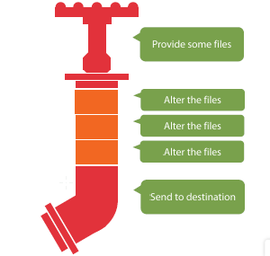

<!-- $size: 4:3 -->

<div style="text-align: center">

# HOW TO AUTOMATE OUR FRONT-END WORKFLOW

## Grunt, Gulp and npm scripts


##### Front-end Developers Madrid

</div>

---

# Who am I

## Luis de Dios Martín (@luisddm_)

- MSc in Telecommunications Engineering
- Started working with Symfony, Wordpress, Android
- 2+ years working in front-end projects
	- Previously with JQuery and Angular
	- Now with Ember.js
- Interested in dara visualization and functional programming
- Also interested in security and internet prococols

---

# Previously, in front-end automation...

## Introduction To Front-End Build Systems

Basic talk about Node, npm, bower, Gulp

https://github.com/luisddm/gulp-examples

---

# Package managers

- A **dependency** is a **software package** that contains one or several **modules or plugins** we rely on for our project.
- Both npm and bower keep track of all the dependencies we need but for different environments/worlds.
	- **npm** manages **modules** that run in the **Node.js** platform.
	- **Bower** manages **front-end components** (i.e. CSS, HTML, and JavaScript) that run in the **browser**.
- Now npm can also be used to manage browser components. It is purely a matter of personal preferences.

## npm `package.json` / bower `bower.json`

---

# Build systems (Grunt, Gulp, npm scripts)

## In one word: AUTOMATION.
- A good automated system **breaks down complex things** into **simple, composable things**.
- Components of an automated system are simple when they have a **single, well-defined objetive**.
- The less work you have to do when performing repetitive tasks, the easier our job becomes.

---

# Build systems then and now

- **Make** was one of the first build systems. In the early days they were used to **compile code into executable** formats for a given OS.
- However, in web development, we have a completely different set of practices and operations.
- Over the past few years, there has been an interest in using build systems to more capably **handle the growing complexities** of our applications.

---

# What can we do?

transpile from ES6+, minify, optimize images, copy, rename and move files, preprocess SASS/LESS/Stylus, add CSS autoprefixing, generate source maps for CSS & JS, run unit tests, run code linting, run style checking, run test coverage reporting, deploy releases, run watcher for developer environment and live reload dev server, etc, etc, etc.

---

# Grunt

- The JavaScript Task Runner.
- Creared in January 2012.
- A Gruntfile is comprised of the following parts:
	- The "wrapper" function
	- Project and task configuration
	- Loading Grunt plugins and tasks
	- Custom tasks

---

# Gulp

- Gulp is a **streaming** JavaScript build system.
- Created in July 2013.
- It leverages the power of **streams** to automate, organize, and run development tasks very quickly and efficiently.
- By simply creating a **small file of instructions**, Gulp can perform just about any development task.

---

# Gulp pipeline



- Gulp uses **small, single-purpose plugins** to modify and process our project files. Additionally, we can **chain**, or **pipe**, these plugins together into more complex actions.

---

# Gulp configuration

- We need a `gulpfile.js` which Gulp will execute each time we want to carry on a task.

- It  will contain **all the tasks** that we'll be able to perform.

- Each task will be build using some methods that belong to modules or plugins provided by the dependencies.

- Each **method** represent a specific purpose and will act as the **building blocks** of our gulp file.

---

# Pros

- There are lots of Gulp plugins and utilities, enough to carry on the **vast majority of the tasks**.

# Cons

- Gulp plugins often **get out of date** and **don't support new features** from the underlying library.
- You become **dependant** on the Gulp plugin author.
- Debugging a Gulp plugin can be frustrating.
	- Is the **problem** in the **plugin** or in the **underlying library**?

---

# Pro or con?
- Focuses on code instead of configuration.
	- The execution isn't hidden by multiple layers and it's much easier to customize it.
	- But sometimes it's more tedious to implement if we just want the default functionality.

---

# Writing a task

```javascript
gulp.task('taskName', () =>
  gulp.src('srcPath')
    .pipe(plugin1)
    .pipe(plugin1)
    .pipe(gulp.dest('destPath'))
```

---

# npm scripts

## shell + node + npm

The `npm run` environment is a shell which runs Node.js executables (or any other kind of executable) via npm.

---

# Chaining operators (for bash-like interpreters)

- With the **AND operator** `&&`, if the left side returns a non-zero exit status, the operator returns that status and does not evaluate the right side (it short-circuits), otherwise it evaluates the right side and returns its exit status.
- The **semicolon** `;` just separates commands. It runs the second command regardless of whether or not the first one succeeds.
- With the **OR operator** `||` the right side is executed if the left side has any error.
- A **single pipe** `|` will forward the output of the first command to the input of the second.

---

# Running our scripts

- We can replace **bash commands** with **node implementations** to keep system-cross compatibiliy: `bash/node`, `cat/catw`, `mkdir/mkdirp`, `rm/rimraf`, `&/npm-run-all --parallel`

- `npm run` loads `node_modules` to the `$PATH`, so we don't need to add the full executable route to execute **local packages**.

- `pre` and `post` in any script to execute **related tasks**.

- name-spaced **sub-tasks** with `npm-run-all`

---

# Careful with the return values

Scripts are run by **passing the line as a script argument** to the shell environment.

If the script exits with **a code other than 0**, then this will **abort** the process.

These script files don't have to be Node.js or even JavaScript programs. They just have to be some kind of **executable** file.

---

```json
{
  "devDependencies": {
    "eslint": "^3.6.0",
    "jshint": "^2.9.3"
  },
  "scripts": {
    "prelint": "echo Start super lint...",
    "lint": "npm-run-all lint:*",
    "lint:jshint": "jshint src/js || true",
    "lint:eslint": "eslint src/js || true",
    "postlint": "echo Lint finished!"
  }
}
```

```bash
$ npm run lint
```

---

# Pros

- We can **run directly any executable**, no matter if it comes from npm or if it's already in our system, which means... **no plugins**!
- bash has been always almost the same, won't change its API.

# Cons
- Less code, but less extensive.
- Shell scripting can be hard, especially **maintaining cross-compatibility** with Windows.
- We need to be sure that any executable that is not provided by a npm package is properly installed and works from `$PATH`.

---

# CLIs (ember-cli, react-cli, angular-cli) -> yeoman
- ember-cli Command line tool for developing ambitious ember.js apps

# scaffolding tools
- yeoman The web's scaffolding tool for modern webapps. CLI tool for running Yeoman generators

---

# Browser packaging (Browserify, Webpack, JSPM)

- browserify, browser-side require() the node way. Feb, 2011.
- webpack, Packs CommonJs/AMD modules for the browser. Allows to split your codebase into multiple bundles, which can be loaded on demand. Support loaders to preprocess files, i.e. json, jsx, es7, css, less, ... and your custom stuff. It was authored by Tobias Koppers @sokra on Mar, 2012.
-jspm

modulos
https://www.nczonline.net/blog/2016/04/es6-module-loading-more-complicated-than-you-think/

---

# gulp-examples
- procesado de plantillas con JADE (PUG)

# otros

- ver egghead.io
ver video David segundo frontend developers
ver lynda descargado

linters
jscs para ver mas limpio el control de versiones
editorconfig

---

# Just because
## my middle name

is **Pancake**,

> doesn't mean you can put syrup on me before I'm ready to come out of the oven.

	mdpress++


```javascript
document.write('Hello, world!');
```
---

# Let's Make Lists!

1. Chicken
2. *Emphasized Chicken*
3. [Chicken Link](http://github.com/egonschiele/mdpress)

- unordered `chicken = 1`
